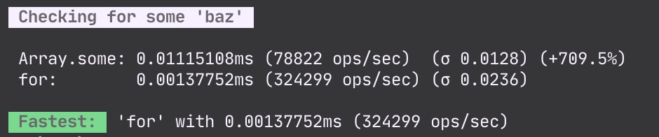

# Yet Another Benchmarking Tool

A `Benchmark` is a set of `Suites` which are sets of `Cases`.

When running a `Benchmark`, each `Case` is run several times.

`Yet Another Benchmarking Tool` uses `window.performance.now` for browser or `perf_hooks.performance.now` for node to measure performance.

## Installation

```bash
# NPM
npm install yet-another-benchmarking-tool

# Yarn
yarn add yet-another-benchmarking-tool
```

## Running

First, configure a suite:

```js
import { Benchmark, Suite } from 'yet-another-benchmarking-tool';

const testArray = Array(1000).fill('foo');
testArray[500] = 'baz';

const suite = new Suite("Checking for some 'baz'", [
  ['Array.some', () => testArray.some((str) => str === 'baz')],
  [
    'for',
    () => {
      for (let i = 0, len = testArray.length; i < len; i += 1) {
        if (testArray[i] === 'baz') return true;
      }
      return false;
    },
  ],
]);
```

Second, create a benchmark:

```js
const benchmark = new Benchmark([suite]);
```

Third, run the benchmark:

```js
benchmark.run();
```

Then get the output to the console:


